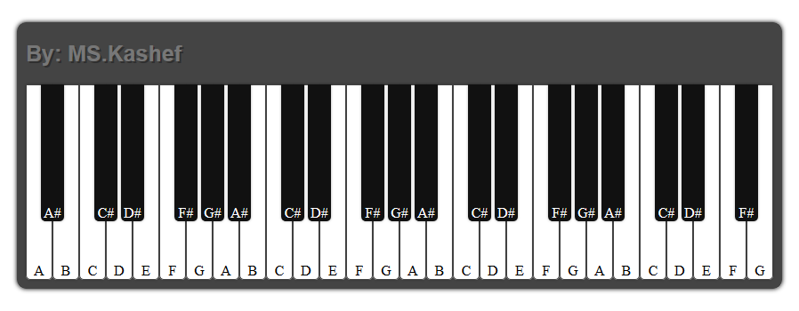

# React Piano
This is a simple opensource piano for someone who want's to learn a bit about working with AudioContext in js an also It's a good practice to increase your skills in web development.
You can also start changing and updating some parts of the code and make it event better.

### Screenshot

### Installation

In the project directory, run `npm install` and then wait until the installation is finished.
once if finished, you can start and run the project with start command (read the below paragraph).

### Starting the project
In the project directory, run `yarn start` or `npm start` to start the project.   
It runs rhe app in the development mode. 
Open [http://localhost:3000](http://localhost:3000) to view it in the browser.

The page will reload if you make edits. 
You will also see any lint errors in the console.

### Build and deployment
In the project directory, run `yarn build` or `npm run build` to build the project.  
It builds the app for production to the `build` folder. 
It correctly bundles React in production mode and optimizes the build for the best performance.

The build is minified and the filenames include the hashes. 
Now the app is ready to be deployed!

